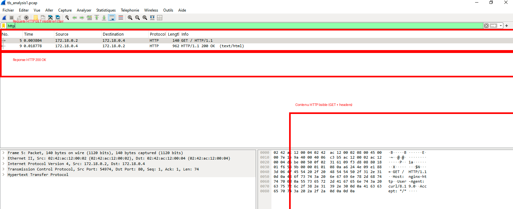
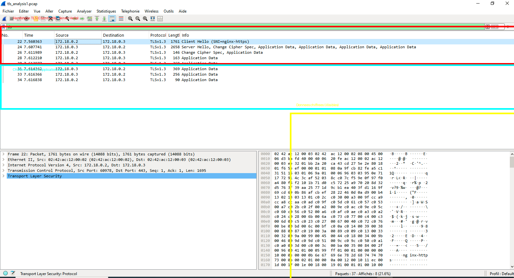

# HTTPS Secure Lab – Analyse TLS & comparaison HTTP vs HTTPS

## Objectif

Ce projet consiste à mettre en place une infrastructure web simulée avec Docker afin de comparer les communications HTTP (non sécurisées) et HTTPS (sécurisées via TLS).

L’objectif est de démontrer concrètement, via capture réseau et analyse Wireshark, les différences de sécurité entre les deux protocoles.

---

## Architecture

Le laboratoire repose sur trois conteneurs Docker :

- **nginx-http** : serveur HTTP (port 80)
- **nginx-https** : serveur HTTPS avec certificat TLS (port 443)
- **client** : machine d’analyse (tcpdump, curl)

## Réseau Docker :
client → nginx-http (HTTP)
client → nginx-https (HTTPS)

---

## Technologies utilisées

- Docker & Docker Compose  
- Nginx  
- OpenSSL (certificat TLS auto-signé)  
- Tcpdump  
- Wireshark  
- Curl  
- TCP/IP / TLS  

---

## Scénarios analysés

---

### Analyse du trafic HTTP

Une requête HTTP est envoyée vers le serveur nginx.

## Résultat :

### Observations

- Requête `GET /` visible en clair  
- Headers HTTP visibles (Host, User-Agent)  
- Réponse serveur `HTTP/1.1 200 OK`  

### Conclusion

> Le protocole HTTP ne chiffre pas les données → les communications sont interceptables.

---

### Analyse du trafic HTTPS (TLS)

Une requête HTTPS est envoyée vers le serveur sécurisé.

## Résultat :

### 🔍 Observations

- Présence d’un handshake TLS :
  - Client Hello
  - Server Hello
- Activation du chiffrement (Change Cipher Spec)
- Données marquées comme `Application Data`
- Contenu illisible dans Wireshark

### Conclusion

> HTTPS utilise TLS pour chiffrer les communications, rendant les données inaccessibles à un observateur réseau.

---

## Comparaison HTTP vs HTTPS

| Élément          | HTTP     | HTTPS  |
|------------------|----------|--------|
| Données lisibles | ✔ Oui   | ❌ Non |
| GET visible      | ✔ Oui   | ❌ Non |
| Headers visibles | ✔ Oui   | ❌ Non |
| Chiffrement      | ❌ Non  | ✔ Oui  |
| TLS Handshake    | ❌ Non  | ✔ Oui  |

---

## Analyse sécurité

### HTTP
- Expose les données en clair
- Vulnérable à l’interception (sniffing, MITM)

### HTTPS
- Chiffre les communications via TLS
- Protège la confidentialité des données
- Utilise certificats X.509

---

## Compétences mises en œuvre

- Analyse de trafic réseau (Wireshark, Tcpdump)  
- Compréhension du protocole TLS  
- Mise en place de serveur HTTPS  
- Génération de certificat (OpenSSL)  
- Comparaison de protocoles réseau  
- Sécurisation des communications  

---

## Résultats

Ce projet démontre :

- la différence concrète entre HTTP et HTTPS  
- l’importance du chiffrement des communications  
- la capacité à analyser du trafic réseau sécurisé  
- la compréhension des mécanismes TLS  

---

## Améliorations possibles

- Mise en place d’un reverse proxy sécurisé  
- Redirection HTTP → HTTPS  
- Ajout de HSTS  
- Utilisation de certificats Let’s Encrypt  
- Simulation d’attaque MITM  
- Analyse TLS avancée (versions, cipher suites)

---

## Intérêt professionnel

Ce projet reproduit un cas réel en cybersécurité :

- analyse de trafic sécurisé  
- compréhension TLS  
- identification des risques réseau  
- bonnes pratiques de sécurisation  

---

## Auteur

**Idrissa SALL**  
Ingénieur IT • Réseaux • Cybersécurité • Data
